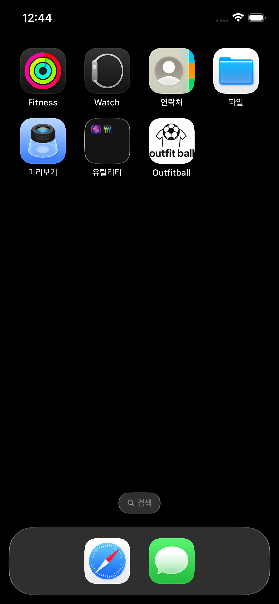
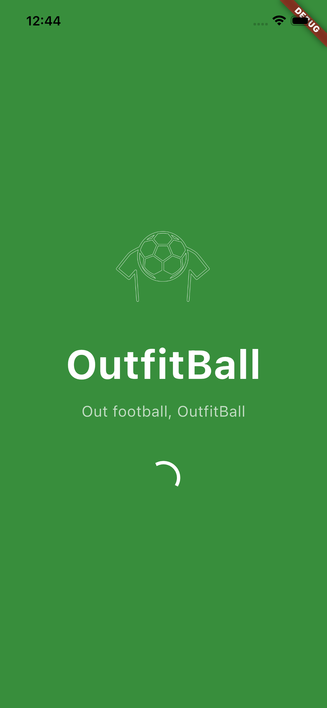
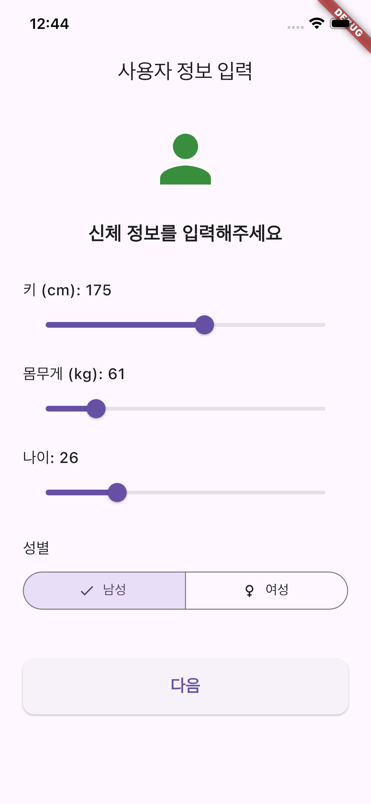
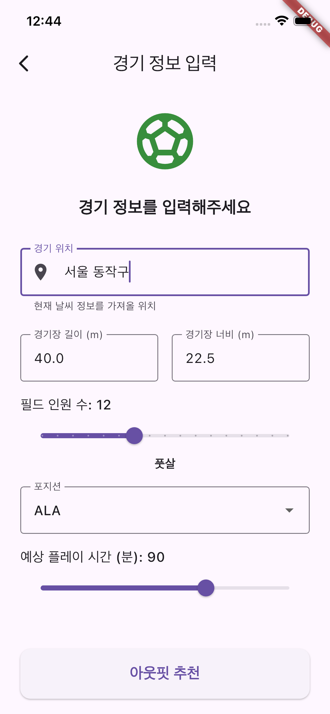
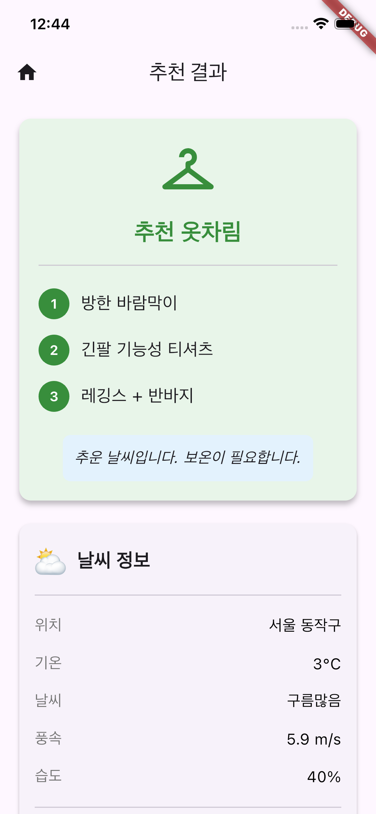
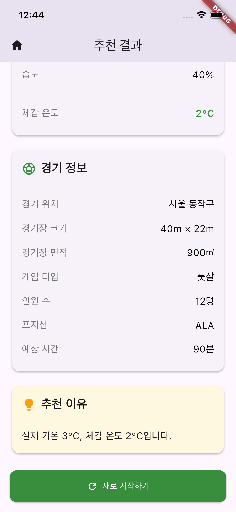

<div align="center">

# ⚽ 아웃핏볼 : OutfitBall
<table><tr><td align="center" bgcolor="#FFFFFF">
  


</td></tr></table>

#### 사용자 입력 및 기상청 날씨 API 기반<br/>축구, 풋살 환경에서의 맞춤형 아웃핏 추천 어플리케이션

[](https://flutter.dev)
[](https://www.apple.com/ios)
[](https://www.apple.com/os/macos/)

</div>


## Contact

- [](https://github.com/jynoh00)
- [](mailto:wndus123sh@naver.com)
- [](https://jynoh00.github.io/)

---


## 📑 목차

- [1. 개발 동기](#-개발-동기)
- [2. 주요 기능](#-주요-기능)
- [3. 사용 API](#-사용-api)
- [4. 프로젝트 구조](#-프로젝트-구조)
- [5. 세부 기능 설명](#-세부-기능-설명)
- [6. 주요 데이터 설정 기준](#-주요-데이터-설정-기준)
- [7. 앱 실행 화면](#-앱-실행-화면)
- [8. 실행 방법](#-실행-방법)
- [9. 실행 환경](#️-실행-환경)
- [10. 개발 환경](#-개발-환경)
- [11. 추후 개선할 점](#-추후-개선할-점)

---

## 💡 개발 동기

본 프로젝트는 우아한테크코스 4~5주차 오픈 미션을 수행하고자 진행되었으며, 자유 주제 형식으로 이루어진 미션인 만큼 새로운 개발 경험을 쌓고 싶어 Flutter를 사용한 iOS 앱 개발을 목적으로 시작하였다.

프로젝트를 결정하는데 있어 가장 크게 고려한 것은 과거에 실패, 포기했던 본인의 경험으로 하였다. 비교적 다가가기 쉬운 웹 개발 위주로 개인 프로젝트를 진행한 점과 API를 활용한 프로젝트를 진행하다 미완성으로 끝냈던 경험에서 API를 활용한 iOS 앱 개발을 선정하였다.

앞선 프리코스 과정에선 전반적으로 처음 진행해보는 방식, 언어, 개발 환경 등을 매주 마주하였는데, 새로운 내용이 불안했던 이전의 내가 타협하고 회피했던 프리코스 이전 개인 프로젝트 경험이 다시 돌아보면 충분히 할 수 있다 라는 생각이 이러한 주제 선정의 큰 근거가 되었다.

애플리케이션의 주 목적은 그래도 본인의 관심사와 엮으며 최대한 실용적인 기능을 제공하게 하고 싶었다. 따라서 평소 취미로 하는 축구 활동에서 겪었던 소소하지만 불편한 내용을 다루고 싶었고, 이러한 과정에서 본인과 같은 사용자의 고민을 덜어주는 앱을 만들고자 하여 프로젝트를 제작하였다.

---

## ✨ 주요 기능

- **실시간 날씨 정보 조회 - 기상청 API 사용**
- **사용자 입력 데이터 기반 운동 강도 계산**
- **운동 강도 및 실제 날씨 기반 체감 온도 계산**
- **사용자 맞춤 체감 온도 기반 의류 추천**

---

## 🔌 사용 API

### 기상청 단기 예보 조회 서비스
- **Provider**: [공공 데이터 포털 (기상청 오픈 API)](https://www.data.go.kr/data/15084084/openapi.do)
- **Purpose**: 실시간 기온, 습도, 풍속 등 날씨 데이터 수집
- **Response Format**: JSON

기상청_단기예보 ((구)_동네예보) 조회서비스를 통해, 사용자 위치 기반 날씨 데이터를 받아와 사용자 맞춤형 아웃핏을 추천하는데 사용한다.

---

## 🏗️ 프로젝트 구조

```
lib/
├── models/              # 데이터 모델
│   ├── game_info.dart
│   ├── outfit_recommendation.dart
│   └── user_profile.dart
│   └── weather_data.dart
│
├── views/               # UI 화면
│   ├── game_input_screen.dart
│   ├── loading_screen.dart
│   └── result_screen.dart
│   └── splash_screen.dart
│   └── user_input_screen.dart
│
├── controllers/         # 컨트롤러
│   ├── app_controller.dart
│
├── services/            # API 및 외부 서비스
│   ├── exercise_calculator.dart
│   └── location_service.dart
│   └── outfit_calculator.dart
│   └── weather_service.dart
│
└── main.dart            # 앱 진입점
```

### MVC 패턴 적용 이유

- **Model**: 날씨 데이터, 사용자 입력 정보, 추천 아웃핏 데이터 등을 독립적으로 관리
- **View**: UI와 내부 로직 분리로 유지보수성 향상
- **Controller**: 데이터 흐름 제어 및 중앙 관리

---

## 🔍 세부 기능 설명

### 1. models

#### game_info.dart
```dart
...

final String location;
final int nx;
final int ny;
final double fieldLength;
final double fieldWidth;
final int playerCount;
final String position;
final double playTime;

...
```

- 축구 및 풋살을 진행하는 장소와 위치 좌표 그 외에 게임의 정보를 데이터로 보관한다.

#### outfit_recommendation.dart
```dart
...

final List<String> items;
final String description;
final double feltTemperature;
final String reasoning;

...
```

- 최종 출력 View 페이지에 해당하는 result_screen.dart에 출력될 아웃핏 추천 데이터들을 보관한다.

#### user_profile.dart
```dart
...

final double height;
final double weight;
final String gender;
final int age;

...
```

- 운동 강도 계산을 위한 BMI 지표의 파라미터들과 성별 및 나이 데이터를 보관한다.

#### weather_service.dart
```dart
...

final int temperature;
final String condition;
final double windSpeed;
final int humidity;
final int rainfall;
final String skyCode;
final String ptyCode;
final DateTime forecastDateTime;

...
```

- weather_service.dart에서 기상청 API를 통해 받아온 JSON response를 파싱하여 사용자가 위치한 곳의 날씨 정보를 데이터로 보관한다.

### 2. services

#### exercise_calculator.dart

```dart
...

class ExerciseCalculator {
  static const Map<String, double> _futsalPositionIntensity = {
    'ALA': 1.09,
    'PIVOT': 0.98,
    'FIXO': 0.93,
    'GOLEIRO': 0.5,
  };

  static const Map<String, double> _soccerPositionIntensity = {
    'FW': 0.98,
    'MF': 1.09,
    'DF': 0.93,
    'GK': 0.5,
  };

  double calculateIntensity({
    ...
  }){
    ...
  }
}
```

- 풋살과 축구에서의 포지션별 평균 이동거리를 기반으로 강도의 상수값 데이터를 보관하며,
- calculateIntensity() 함수에서 필드의 크기와 인원 수, 사용자의 프로필 정보를 추가로 이용하여 최종 강도를 반환한다.

#### location_service.dart

```dart
...

'서울 성동구': {'nx': 61, 'ny': 127},
'서울 광진구': {'nx': 62, 'ny': 126},
'서울 동대문구': {'nx': 61, 'ny': 127},
'서울 중랑구': {'nx': 62, 'ny': 128},
'서울 성북구': {'nx': 61, 'ny': 127},
'서울 강북구': {'nx': 61, 'ny': 128},
'서울 도봉구': {'nx': 61, 'ny': 129},

...
```

- 기상청 단기 예보 API를 호출할 때 인자로 전달하는 사용자의 위치 좌표를 Map 자료구조로 보관한다.

#### location_service.dart

```dart
...

'서울 성동구': {'nx': 61, 'ny': 127},
'서울 광진구': {'nx': 62, 'ny': 126},
'서울 동대문구': {'nx': 61, 'ny': 127},
'서울 중랑구': {'nx': 62, 'ny': 128},
'서울 성북구': {'nx': 61, 'ny': 127},
'서울 강북구': {'nx': 61, 'ny': 128},
'서울 도봉구': {'nx': 61, 'ny': 129},

...
```

- 기상청 단기 예보 API를 호출할 때 인자로 전달하는 사용자의 위치 좌표를 Map 자료구조를 통해
- 입력한 문자열을 좌표쌍으로 반환한다.

#### outfit_calculator.dart

```dart
...

OutfitRecommendation calculateOutfit({
required WeatherData weather,
required GameInfo gameInfo,
required UserProfile userProfile,
}) {
double exerciseIntensity = _exerciseCalculator.calculateIntensity(
    gameInfo: gameInfo,
    userProfile: userProfile,
);

double feltTemp = _calculateFeltTemperature(
    actualTemp: weather.temperature.toDouble(),
    exerciseIntensity: exerciseIntensity,
    windSpeed: weather.windSpeed,
    humidity: weather.humidity,
);

return _generateRecommendation(
    feltTemperature: feltTemp,
    weather: weather,
    exerciseIntensity: exerciseIntensity,
);
}

...
```

- 사용자 입력값과 날씨 데이터를 기반으로 맞춤형 아웃핏 데이터를 outfit_recommendation.dart의 객체에 할당한다.

#### weather_service.dart

```dart
...

class WeatherService {
  static const String _serviceKey = '-API 키-';
  static const String _baseUrl = 'https://apis.data.go.kr/1360000/VilageFcstInfoService_2.0/getVilageFcst';
  
  Future<WeatherData> fetchWeather(int nx, int ny) async {
    try {
      Map<String, String> baseDateTime = _getBaseDateTime();
      
      final queryParameters = {
        'serviceKey': _serviceKey,
        'pageNo': '1',
        'numOfRows': '1000',
        'dataType': 'JSON',
        'base_date': baseDateTime['base_date']!,
        'base_time': baseDateTime['base_time']!,
        'nx': nx.toString(),
        'ny': ny.toString(),
      };
      
      final uri = Uri.parse(_baseUrl).replace(queryParameters: queryParameters);
      print('API 호출: $uri');
      
      final response = await http.get(uri);
      
      if (response.statusCode == 200) {
        final jsonData = json.decode(response.body);
        
        if (jsonData['response']['header']['resultCode'] == '00') {
          return _parseWeatherData(jsonData);
        } else {
          print('API Error: ${jsonData['response']['header']['resultMsg']}');
          return _getDemoData();
        }
      } else {
        print('HTTP Error: ${response.statusCode}');
        return _getDemoData();
      }
    } catch (e) {
      print('Weather API Error: $e');
      return _getDemoData();
    }
  }
}

...
```

- 현재 시각과 사용자 위치 좌표를 인자로 http 통신을 통해 API를 호출하며
- 받아온 json 데이터를 weather_data.dart의 객체에 맞는 자료형으로 파싱하여 할당한다.

### 3. views

```dart
game_input_screen.dart // 축구 및 풋살 게임에서의 정보와 위치 데이터를 입력하는 View 코드
loading_screen.dart // 날씨 API를 받아오는 과정에서 소요되는 시간동안 보여지는 View 코드
result_screen.dart // 추천 아웃핏을 출력하여 사용자에게 보여주는 View 코드
splash_screen.dart // 애플리케이션의 시작 시 나타나는 View 코드
user_input_screen.dart // 사용자의 정보를 입력하는 화면을 보여주는 View 코드
```

### 4. others

```dart
app_controller.dart // 모델과 서비스, 뷰를 연결하여 전체 앱의 진행을 담당하는 컨트롤러
main.dart // 프로그램의 진입점
```

---

## 🔢 주요 데이터 설정 기준

### 포지션별 운동 강도 상수
```dart
static const Map<String, double> _futsalPositionIntensity = {
'ALA': 1.09,
'PIVOT': 0.98,
'FIXO': 0.93,
'GOLEIRO': 0.5,
};

static const Map<String, double> _soccerPositionIntensity = {
'FW': 0.98,
'MF': 1.09,
'DF': 0.93,
'GK': 0.5,
};
```

포지션 별 운동 강도는, 평균 경기 진행 시<br>
```
해당 포지션 선수의 평균 이동거리 / 모든 포지션 선수의 평균 이동 거리의 합
```
으로 계산하였으며, 다음의 학위 논문에서 자료를 참조하였다.

- 서문학 (2009). 포지션별 축구선수의 신체활동량과 칼로리소비량 비교. 교육학석사학위논문, 조선대학교 교육대학원 체육교육전공.

### 총 강도 계산
```dart
double calculateIntensity({
required GameInfo gameInfo,
required UserProfile userProfile,
}) {
Map<String, double> intensityMap = gameInfo.isFutsal 
    ? _futsalPositionIntensity 
    : _soccerPositionIntensity;

int meanMapSize = gameInfo.isFutsal ? 900 : 6560; // 평균 규격

double positionIntensity = intensityMap[gameInfo.position] ?? 1.0;
double fieldFactor = gameInfo.fieldSize / meanMapSize;
double timeFactor = gameInfo.playTime / 60;
double fitnessFactor = userProfile.fitnessLevel;

return positionIntensity * fieldFactor * timeFactor * fitnessFactor;
}
```

총 강도는 위와 같이 계산하였으며<br>
평균 풋살장, 축구장 규격 기준 대비 경기장 크기와, 
<br>평균 경기 진행 시간 대비 사용자 경기 진행 시간,
<br>사용자의 fitnessFactor를 곱연산한 값을 총 운동 강도로 반환한다.

### 사용자 신체 요소 (fitnessFactor, fitnessLevel)

```dart
double get bmi => weight / ((height / 100) * (height / 100));

double get fitnessLevel {
    double bmiFactor = 1.0;
    if (bmi < 18.5) bmiFactor = 1.15;
    if (bmi > 25) bmiFactor = 1.15;

    double ageFactor = 1.0;
    if (age > 30) ageFactor = 1.15;
    if (age > 40) ageFactor = 1.3;
    if (age < 15) ageFactor = 1.15;

    return bmiFactor * ageFactor;
}
```

사용자 신체 요소의 경우<br>
대한비만학회 제공 "비만 치료지침(2022 8판)" 기준, 계산한 BMI값에 따라 저체중과 비만에 해당하는 경우 요소 값이 증가하게 설정하였으며 <br>
이를 나이별 운동 능력의 차이에 따라 ageFactorf로 기준을 설정하여 곱연산한 값을 반환 후 사용하였다.

### 운동 강도 고려, 체감 온도 계산
```dart
double _calculateFeltTemperature({
    required double actualTemp,
    required double exerciseIntensity,
    required double windSpeed,
    required int humidity,
}) {
    double bodyTempIncrease = _calculateMetabolicHeatEffect(exerciseIntensity);
    double windChillEffect = _calculateWindChillEffect(actualTemp, windSpeed);
    double humidityEffect = _calculateHumidityEffect(actualTemp, humidity, exerciseIntensity);

    double feltTemp = actualTemp + bodyTempIncrease - windChillEffect + humidityEffect;

    return feltTemp;
}
```

이후 최종 맞춤형 outfit을 추천함에 있어 고려하는 요소인 체감 온도의 경우<br>
운동 강도 기반 신체 온도 상승과, 바람으로 인한 체감 온도 감소, 습도로 인한 체감 온도 상승을 고려하여 설정하였다.

---

## 📱 앱 실행 화면

#### 앱 설치 완료

*iOS 내 Outfitball 앱 설치*

#### 스플래시 화면

*앱 시작*

#### 사용자 정보 입력 화면

*사용자 키, 몸무게, 나이 및 성별 입력*

#### 경기 정보 입력 화면

*경기 진행 장소 정보 입력 및 사용자 포지션, 경기 시간 입력*

#### 로딩 화면

*기상청 API 호출 및 outfit 출력 로직 진행*

#### 결과 출력 화면



*사용자 입력 데이터, 날씨 데이터 기반 맞춤형 outfit 출력*

---

## 🚀 실행 방법

### 1. iOS 시뮬레이터 실행
```bash
open -a Simulator
```

### 2. Flutter 앱 실행
```bash
flutter run
```

### 3. 특정 디바이스 지정
```bash
flutter run -d "iPhone 16 Pro"
```

---

## 🖥️ 실행 환경

| 항목 | 버전/사양 |
|------|----------|
| **플랫폼** | iOS 26.1 |
| **디바이스** | iPhone 16e (Simulator) |
| **시뮬레이터** | Xcode 26.1 |

---

## 🛠 개발 환경

| 도구 | 버전 |
|------|------|
| **IDE** | Visual Studio Code 1.106.0 |
| **Flutter SDK** | 3.35.7 |
| **Dart SDK** | 3.9.2 |
| **운영체제** | macOS Sequoia 15.7.2 |

---

## 🔮 추후 개선할 점

- Android, macOS, web 버전 적용
- 전문 자료 기반 outfit_recommendation 세분화
- 사용 상수 및 매직 넘버 JAVA Enum과 같이 따로 분류 및 관리
- 이전 iOS 버전과 호환성 테스트 및 적용
- 오픈 API 데이터를 단기가 아닌 중기 예보로 변경, 당일이 아닌 경기 또한 계산 가능하게 수정
- GPS 기반 자동 사용자 위치 조회 기능 추가